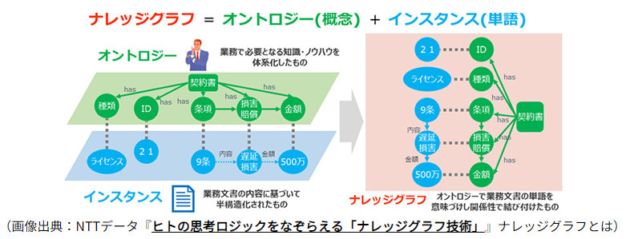
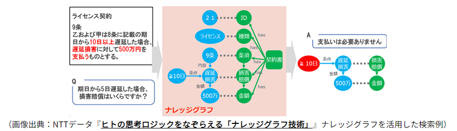
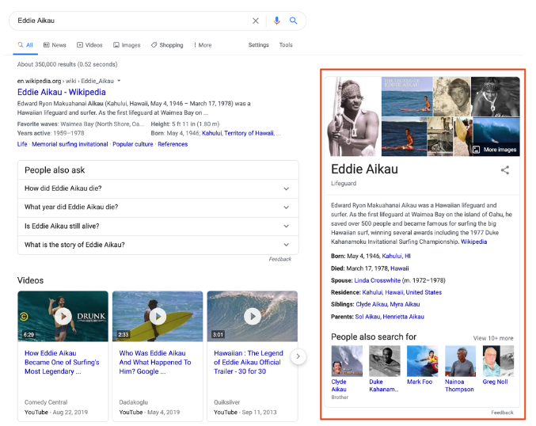
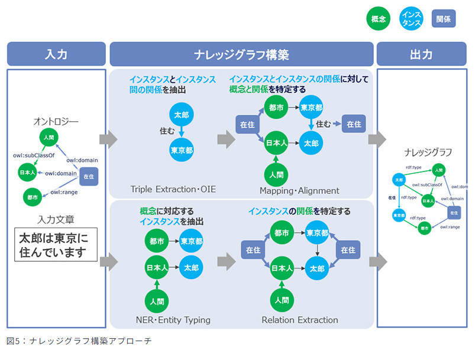
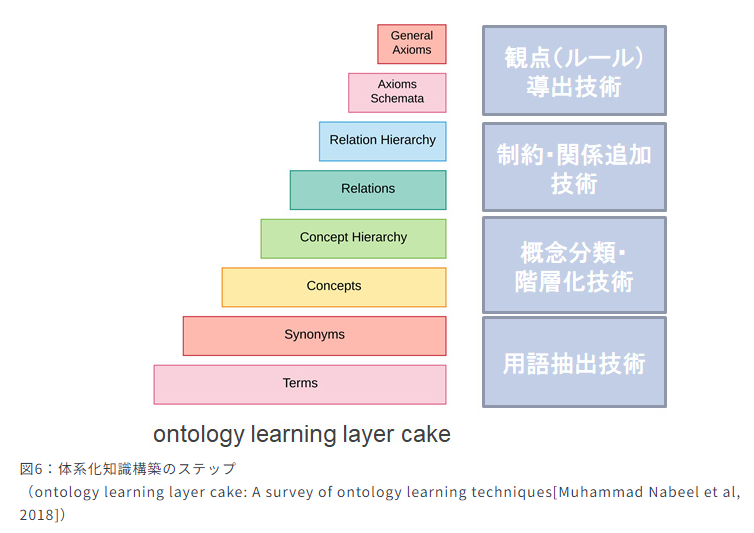

# Knowledge Graphとは

## サイトの情報チェック

### [Qiita: Knowledge Graph とは何か(2019年の記事)](https://qiita.com/MeguruMokke/items/e707d231d75db8057f96)

> #### Knowledge Graph とは 推論を行うことができる賢いものである
>
> Knowledge Graph の基礎としてみなされるものは、ontology です。  
> **ontology** とはデータの意味を示しており、これは通常、何らかの形の**推論を補助する論理形式**に基づいています。  
> つまり暗黙の情報を明示的に表されているデータから導き出すことを可能にしているということです。  
> また推論された情報中には、このような**手法を用いなければ見つけることが不可能なような関係性が含まれる**可能性があります。  
> (これがKnowledge Graphに期待される特性の一つとして挙げることができるでしょう)  
> Knowledge Graph は数学的に適切なグラフ構造を取ることが一般的であり、  
> このために最短経路問題やネットワーク解析などの様々なグラフ構造のための問題に落ち着かせることができます。  
> またSQLのような厳密すぎず無茶苦茶なものでもない適当なスキーマを用いることで、逐次的にデータのやり取りを行うことができます。  
> これによって Knowledge Graph は時間をかけて**拡張していくことが可能**になっています。

### [NTT: ナレッジグラフとは？特徴や作り方、活用法をわかりやすく解説](https://www.rd.ntt/se/media/article/0025.html)

> ナレッジグラフ = **オントロジー(概念)** + **インスタンス(単語)**
>
> 
>
> 
>
> レッジグラフの活用により、条件などを伴う情報を明示的に解析できます。  
> また、契約書チェック以外にも、整合性チェックやマニュアル検索などに必要となる細かな観点でのチェックや、  
> 文書ごとに表現が異なる情報の検索などへの活用が期待されます。

- ナレッジグラフの一般化された構築手順
    1. 知識の観察
        - まず、各領域で生み出されてきた勘と経験による知識を観察し、発生している課題の解決方法を考える。
    1. 知識の体系化
        - 関連資料の調査や現場との意見効果を通じて知識を整理、定義、あるいは再定義し、また体系化することにより、ナレッジグラフを構築する。
    1. 知識のICT化
        - 構築されたナレッジグラフはLinked Dataの形式でデータ化した上で、さらに現場での利活用が可能なように、必要な形式のデータ作成や関連サービスの開発を行う。
    1. 知識の社会化
        - データと関連サービスを公開し、その領域の現場での利活用を推進する。

!!! note
    本資料では具体的な分析の方法や課題の定義方法などは触れていない

### [Google: Googleのナレッジグラフの仕組み-ナレッジパネルヘルプ](https://support.google.com/knowledgepanel/answer/9787176?hl=ja)

!!! note
    ナレッジグラフのポリシーや概要の説明
    具体的なアルゴリズムや仕組みについては記載されていない

### [Google:Google Japan Blog: Google検索のナレッジグラフとナレッジパネルとは](https://japan.googleblog.com/2020/05/KnowledgeGraphKnowledgePanel.html)

- Googleのナレッジグラフは「ナレッジパネル」として結果が表示される

!!! note
    ナレッジパネルの紹介
    具体的なアルゴリズムや仕組みについては記載されていない

### [NTTデータ: ヒトの思ロジックをなぞらえる「ナレッジグラフ技術」](https://www.nttdata.com/jp/ja/trends/data-insight/2020/0608/)

#### ヒトの思考ロジックをなぞらえる: 概要

- 「契約書の文章の構成内容」と「リスクチェック観点」の紐づけることが目的
    - これにより、リスク該当箇所を特定することができる
- オントロジーは「単語間の関係」と「単語の意味(業務上の概念)」を結び付けたもの
    - 文章がどういう情報を保持するのかを示す
- インスタンスは「文書」を解析した結果
    - 実際の文章に記載されている内容
- ナレッジグラフはオントロジーとインスタンスを紐づけて「人が文章を読むときの理解の流れ」を模倣する

#### ヒトの思考ロジックをなぞらえる: ナレッジグラフの技術

- **構築技術**: 単語を抽出し業務上の概念と紐づける構築技術
    - 文章と概念を紐付ける
    - （1）の手法は、入力文章から、「太郎が東京都に住む」という関係を抽出し、  
      「東京都が都市」であり、  
      「太郎は日本人」、  
      「住むのが在住」  
      という概念であることを紐づけます。
- **体系化技術**: 業務上の概念を表現するオントロジーの構築
    - 構築技術の結果から情報間の関係を抽出する
    - （2）の手法は、入力文章に対して、  
      「都市」に相当する「東京都」、  
      「日本人」に相当する「太郎」を 抽出し、  
      「都市」と「日本人」の関係から  
      「東京都」と「太郎」の関係を判定します。

- **体系化技術の構築ステップ**
    - 観点(ルール)導出技術
    - 制約・関係追加技術
    - 概念分類・階層化技術
    - 用語抽出技術

!!! note
    大枠の手法について記載されていた。  
    詳細や実装方法や実際のテキストからの抽出方法などは不明。
